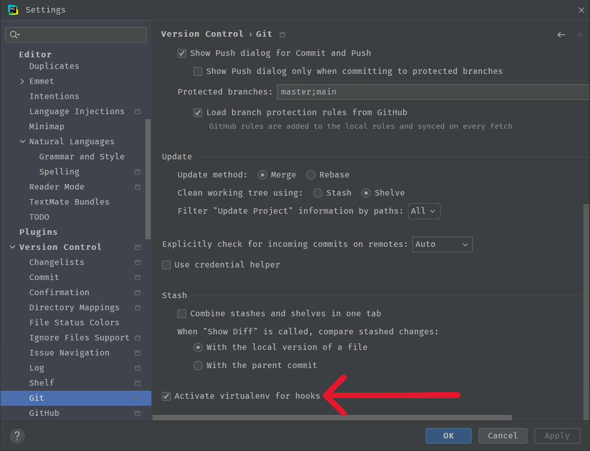

# Pre-commit requirements
* Golang installed
* Terraform installed
* Linux (or WSL) (Terraform_validate script is written in Bash)

### WSL with Pycharm
1. go to [File | Settings | Version Control | Git](jetbrains://Python/settings?name=Version+Control--Git)
2. find `Activate venv for hooks`
3. check the box
4. if you aren't using a WSL venv, create one and switch to it

